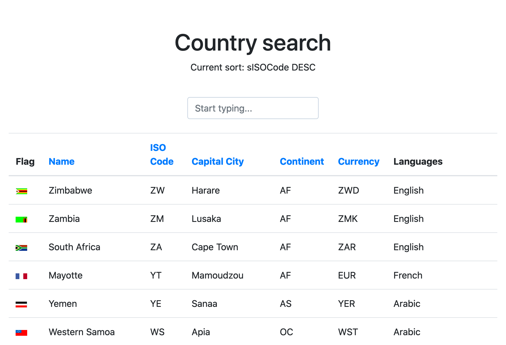

#Task 1: SQL Queries
```sql
#1
SELECT SUM(Z.Kwota), K.Miasto
FROM Zamowienia Z
         LEFT JOIN Klienci K ON K.NrKlienta = Z.NrKlienta
WHERE Z.DataZaplaty IS NOT NULL
GROUP BY K.Miasto;

#2
SELECT SUM(Z.Kwota), K.Miasto, DATE_FORMAT(Z.DataZlozenia, '%Y-%m') as Miesiac
FROM Zamowienia Z
         LEFT JOIN Klienci K ON K.NrKlienta = Z.NrKlienta
WHERE Z.DataZaplaty IS NOT NULL
GROUP BY YEAR(Z.DataZlozenia), MONTH(Z.DataZlozenia), K.Miasto;

```
#Task 2: Country Search



Simple country search made with Symfony 5 and Vue.js

Data source: 
http://webservices.oorsprong.org/websamples.countryinfo/CountryInfoService.wso?WSDL

###TODO
* Search by currency
* Cache
* Languages sort
* Fetch continent name

##HOW TO USE IT 
```docker-compose up```

GUI available at: http://localhost:4000

API available at: http://localhost:5000

##API ENDPOINTS
`GET` /countries - accept `q` parameter with query to filter countries by: name, iso code, currency.

##GUI TIPS
* Start typing to search countries
* Click on column name to sort, click again to change direction

